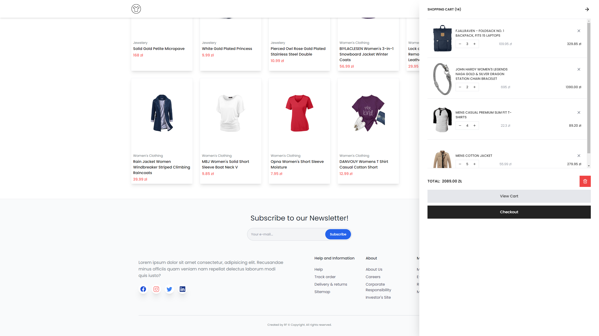

<br/>
<div align="center">
  <a href="">
    
  </a>

  <h1 align="center">E-commerce Website</h1>

  <p align="center">
    <a href="https://ecmrc-react-ts-redux-rf.netlify.app/"><strong>Live Website »</strong></a>
    <br/>
    <br/>
  </p>
</div>

<details>
  <summary>Table of Contents</summary>
  <ol>
    <li>
      <a href="#about-project">About Project</a>
    </li>
    <li>
      <a href="#screenshots">Screenshots</a>
    </li>
    <li><a href="#tech-stack">Tech Stack</a></li>
    <li>
      <a href="#installation">Installation</a>
    </li>
  </ol>
</details>
 <br />

## About Project

E-commerce website built using <b>React JS</b> with <b>Redux</b>, <b>Typescript</b> and designed using <b>Tailwind CSS</b>. Website is fully responsive and uses reusable components that take certain props. All of the displayed shop items are fetched from Fake Store API using Axios. The website allows users to add items to the shopping cart and fully manage the cart: you can increase and decrease the number of items in the cart, remove individual items in the cart, and clear the entire cart with one click. In addition, the shopping cart continuously updates the number of items in it and displays the calculated value of individual items and the total value of the entire shopping cart. Redux allows access to all store products and all functions related to shopping cart status management from anywhere on the site. Each store item has its own dynamically generated page, which contains detailed product information and, using Swiper, allows to browse other products.

## Screenshots





## Tech Stack

- 
- 
- 
- 
- 
- Axios
- Swiper
- React Icons
- React Spinners

## Installation

To get started with this project, simply clone the repository:

```bash
git clone https://github.com/Vertori/ecmrc-react-ts-redux.git
```

Use the package manager [npm](https://www.npmjs.com/) to install the dependencies.

```bash
npm install
```

After that, run the following command to start the development server:

```bash
npm run dev
```
